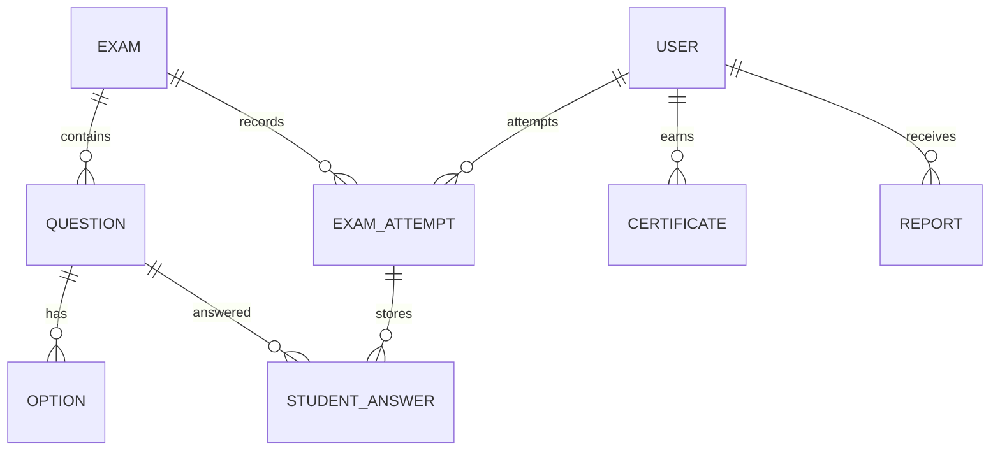
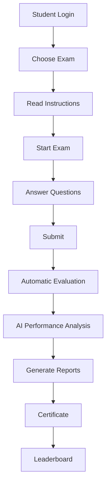
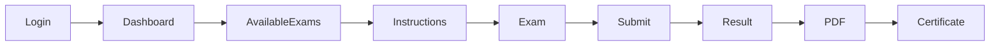
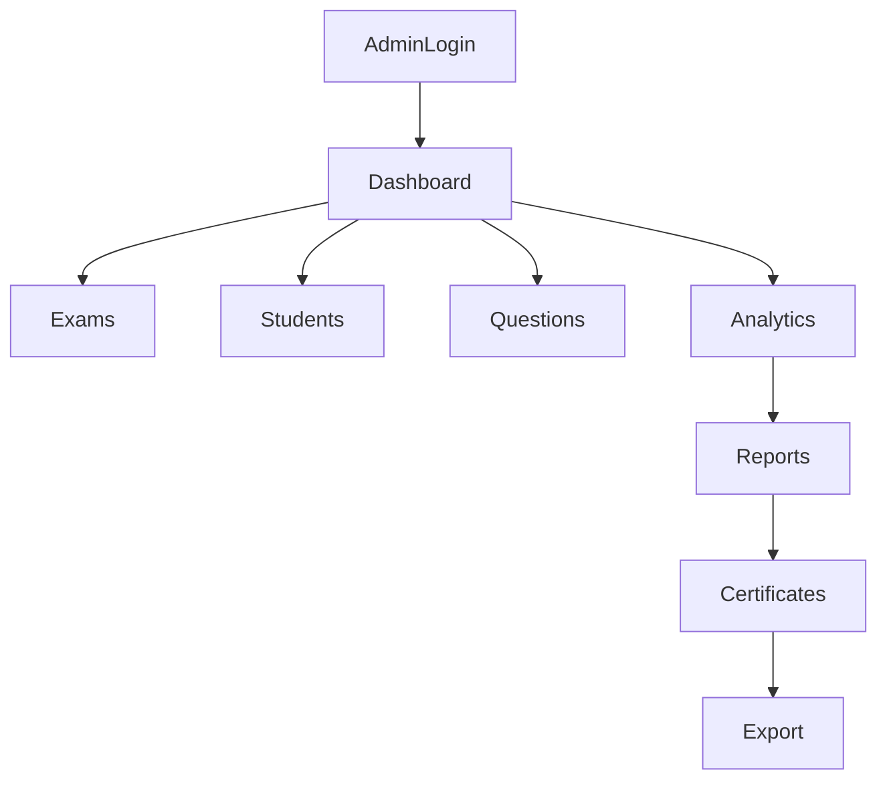

<h1 align="center">
🎓 AI Exam Portal
</h1>

<p align="center">
<b>Smart Online Examination System built with Django, AI Analytics & PostgreSQL</b>
</p>

<p align="center">
Secure • Fast • AI Powered • Production Ready • Responsive
</p>

<p align="center">

</p>

<p align="center">

# 🚧 Project Banner Placeholder

> Replace `static\images\banner.png` with your project banner.

</p>

---

<p align="center">


<<<<<<< HEAD


</div>
=======


</p>
>>>>>>> 78f976d4c6d385ecc24ddb1459e26d48f0abb416

<h3 align="center">

<<<<<<< HEAD
🚀 AI-powered online examination platform with automated evaluation, intelligent performance analytics, AI feedback, and digital report generation.

</h3>


---

# 📌 Project Overview

**AI Exam Portal** is a complete smart online examination management system developed using **Django 5 Framework**.

The platform provides a modern examination environment where students can attend online tests, receive instant results, analyze their performance, and get AI-based recommendations for improvement.

The system transforms traditional examination processes into a digital workflow by providing:

- Automated evaluation
- Instant result generation
- Performance analytics
- AI-based feedback
- Digital report generation

---

# 🎯 Project Objectives

- Build a complete online examination platform
- Automate student answer evaluation
- Reduce manual evaluation effort
- Provide instant examination results
- Analyze student learning performance
- Identify strong and weak areas
- Generate personalized improvement suggestions
- Improve digital learning experience


---

# 🌟 Project Highlights

✅ Django MVT Architecture  
✅ Secure Authentication System  
✅ Exam Management Module  
✅ Question & Option Management  
✅ Timed Online Examination  
✅ Automatic Evaluation Engine  
✅ AI Performance Feedback  
✅ Weak Topic Recommendation  
✅ Analytics Dashboard  
✅ Chart.js Visualization  
✅ PDF Result Generation  
✅ CSV Report Export  
✅ Leaderboard System  
✅ Certificate Generation  
✅ Production Ready Structure  


---

# ✨ Features


# 👨‍🎓 Student Features


## 🔐 Authentication System

Students can:

- Create account
- Login securely
- Logout
- Access examination dashboard
- View previous examination attempts


---

## 📝 Online Examination Module

Students can:

- View available exams
- Read exam instructions
- Start examinations
- Answer multiple-choice questions
- Submit answers
- View instant results


---

## ⏱️ Smart Exam Timer

The examination engine provides:

- Countdown timer
- Exam duration control
- Time tracking
- Automatic submission handling


Exam workflow:


Start Exam

  ↓

Timer Starts

  ↓

Answer Questions

  ↓

Submit Exam

  ↓

Automatic Evaluation

  ↓

Generate Result

  ↓

AI Feedback


---

## 💾 Student Answer Tracking

The system stores:

- Student answers
- Selected options
- Exam attempts
- Submission information
- Performance history


---

# ✅ Automatic Evaluation System

After exam submission, the system automatically evaluates student performance.


Student Submission

    ↓

Answer Verification

    ↓

Score Calculation

    ↓

Result Generation

    ↓

Performance Analysis


Generated result contains:

- Total marks
- Obtained marks
- Percentage
- Correct answers
- Wrong answers
- Accuracy
- Pass/Fail status


---

# 📊 Result Management


Students can view detailed result analysis.


## Result Information


| Information | Description |
|---|---|
| Exam Name | Attempted examination |
| Score | Obtained marks |
| Percentage | Final percentage |
| Accuracy | Correct answer ratio |
| Status | Pass or Fail |
| Date | Submission date |


---

# 📚 Exam History

Students can track:

- Previous examinations
- Previous scores
- Performance improvement
- Learning progress


---

# 🤖 AI Performance Feedback Engine

The project includes an intelligent feedback system that analyzes student performance and generates personalized recommendations.


## AI Analysis Includes


### 📈 Performance Analysis

Analyzes:

- Overall score
- Accuracy
- Difficulty level
- Subject performance
- Answer patterns


---

### 💪 Strength Identification

Identifies:

- Strong topics
- Best-performing concepts
- Successful learning areas


---

### ⚠️ Weak Topic Recommendation

Detects:

- Incorrect answer patterns
- Difficult concepts
- Areas requiring improvement


---

### 🎯 Personalized Suggestions

Provides:

- Learning recommendations
- Improvement strategies
- Preparation guidance


Example:


Excellent Performance!

Your Python fundamentals are strong.

Recommended Improvement:

Focus more on Exception Handling,
Object-Oriented Programming,
and Advanced Python concepts.


---

# 📈 Analytics Dashboard

The admin dashboard provides complete examination insights.


## Dashboard Metrics


| Metric | Description |
|---|---|
| Total Exams | Number of created examinations |
| Total Students | Registered users |
| Total Attempts | Completed exams |
| Average Score | Overall performance |
| Pass Percentage | Examination success rate |
| Subject Analysis | Subject-wise performance |
| Difficulty Analysis | Difficulty-based performance |


---

# 📊 Data Visualization

Implemented using:

## Chart.js


Provides:

- Performance graphs
- Score comparison
- Subject analysis charts
- Student progress visualization


---

# 📄 PDF Result Generation

The application generates professional PDF reports using:

## ReportLab


PDF report includes:


Student Name

Exam Title

Total Marks

Obtained Marks

Percentage

Pass/Fail Status

Submission Date

AI Feedback Summary


Students can download and store examination reports.


---

# 📥 CSV Report Export

The system supports exporting performance data.


CSV contains:

- Student details
- Exam information
- Scores
- Results
- Performance analysis


---

# 🏆 Leaderboard System

The leaderboard ranks students based on examination performance.


Displays:


Rank

Student Name

Score

Percentage

Accuracy


---

# 🎓 Certificate Generation

The system generates digital certificates for completed examinations.


Certificate includes:


Student Name

Exam Title

Score

Completion Date

Achievement Message


=======
# 📚 AI Exam Portal

> **A modern, intelligent, secure, and scalable online examination platform built using Django.**

AI Exam Portal is a **production-ready online examination system** that enables educational institutions, colleges, universities, coaching centers, and organizations to conduct secure online examinations with AI-powered analytics, automatic evaluation, digital report generation, certificates, and detailed performance insights.

The platform is designed with scalability, security, and ease of use in mind. Students can participate in exams seamlessly while administrators have complete control over exam creation, monitoring, evaluation, and analytics.

---

# 🌟 Key Highlights

- 🎯 Secure Online Examination
- 🤖 AI Performance Analysis
- 📈 Interactive Analytics Dashboard
- 📄 PDF Result Reports
- 🏆 Certificate Generation
- 📊 Charts & Graphs
- ⏱ Countdown Timer
- 🔀 Random Questions
- 🔀 Random Options
- ❌ Negative Marking
- 🔒 Authentication System
- 👨‍💼 Admin Dashboard
- 👨‍🎓 Student Dashboard
- 🌐 Responsive Design
- 🐘 PostgreSQL Ready
- 🚀 Render Deployment Ready

---

# 📑 Table of Contents

- Project Description
- Live Demo
- Features Overview
- Student Features
- Admin Features
- AI Features
- Security Features
- Screenshots
- Technology Stack
- Project Architecture
- Folder Structure
- Database Schema
- Installation
- Deployment
- Workflow
- AI Analysis
- Analytics Dashboard
- Reports
- Future Scope
- Contributing
- FAQ
- License
- Author

---

# 🌍 Live Demo

| Resource | Link |
|----------|------|
| 🌐 Live Demo | [Ai-Exam-Portal](https://ai-exam-portal-qmax.onrender.com/) |
| 💻 GitHub Repository | https://github.com/Venumohan004/AI-Exam-Portal |
| 👨‍💻 Portfolio | https://yourportfolio.com |
| 💼 LinkedIn | [P VENUMOHAN](https://www.linkedin.com/in/venumohan-p-522017346) |

> **Replace all placeholders with your actual links.**

---

# 🚀 Features Overview

| Category | Available |
|-----------|-----------|
| Student Dashboard | ✅ |
| Admin Dashboard | ✅ |
| Exam Management | ✅ |
| Question Bank | ✅ |
| Multiple Choice Questions | ✅ |
| Automatic Evaluation | ✅ |
| AI Performance Feedback | ✅ |
| Result Analytics | ✅ |
| Leaderboard | ✅ |
| Certificates | ✅ |
| PDF Reports | ✅ |
| CSV Export | ✅ |
| Authentication | ✅ |
| Responsive UI | ✅ |
| PostgreSQL Support | ✅ |

---

# 👨‍🎓 Student Features

- Student Registration
- Secure Login
- Personalized Dashboard
- View Available Exams
- Exam Instructions
- Countdown Timer
- Randomized Questions
- Randomized Options
- Submit Exam
- Auto Submit
- Instant Result
- AI Feedback
- Performance Report
- PDF Download
- Certificate Download
- Leaderboard Ranking
- Previous Attempts
- Profile Management

---

# 👨‍💼 Admin Features

- Admin Login
- Dashboard
- Student Management
- Exam Management
- Question Management
- Option Management
- Result Management
- Performance Analytics
- PDF Report Generation
- Certificate Generation
- Leaderboard Control
- User Authentication
- Exam Monitoring
- Export Reports
- Manage Attempts

---

# 🤖 AI Features

- AI Performance Analysis
- Weak Topic Detection
- Strong Topic Detection
- Personalized Suggestions
- Performance Trends
- Accuracy Analysis
- Improvement Recommendations
- Score Prediction (Future)
- AI Insights
- Smart Feedback Generation

---

# 🔐 Security Features

- Django Authentication
- Password Hashing
- CSRF Protection
- SQL Injection Protection
- XSS Protection
- Secure Session Management
- Admin Authorization
- Login Required Decorators
- Production Ready Settings
- PostgreSQL Compatibility

> [!NOTE]
> Django provides many security mechanisms out of the box. This project follows recommended Django security practices for authentication, CSRF protection, and session handling.
>>>>>>> 78f976d4c6d385ecc24ddb1459e26d48f0abb416

---

# 📸 Screenshots

<<<<<<< HEAD
Add project screenshots inside:


assets/

│
├── dashboard.png
├── exam-page.png
├── result-page.png
└── analytics-dashboard.png


Example:


```markdown


---

# 🛠️ Technology Stack

=======
| Screen | Preview |
|----------|----------|
| Dashboard |  |
| Exam |  |
| Result |  |
| Analytics |  |

---

# 🛠 Technology Stack
>>>>>>> 78f976d4c6d385ecc24ddb1459e26d48f0abb416

## Backend

| Technology | Purpose |
<<<<<<< HEAD
|---|---|
| Python 3.12 | Programming Language |
| Django 5 | Web Framework |
| Django ORM | Database Operations |
| Django Authentication | User Management |


=======
|------------|----------|
| Python 3.12 | Programming Language |
| Django 5 | Backend Framework |
| Django ORM | Database ORM |
| Django Authentication | User Management |

>>>>>>> 78f976d4c6d385ecc24ddb1459e26d48f0abb416
---

## Frontend

| Technology | Purpose |
<<<<<<< HEAD
|---|---|
| HTML5 | Page Structure |
| CSS3 | Styling |
| JavaScript | Client-side Logic |
| Bootstrap 5 | Responsive UI Design |

=======
|------------|----------|
| HTML5 | Structure |
| CSS3 | Styling |
| JavaScript ES6 | Client Logic |
| Bootstrap 5 | Responsive UI |
>>>>>>> 78f976d4c6d385ecc24ddb1459e26d48f0abb416

---

## Database

<<<<<<< HEAD
| Database | Usage |
|---|---|
| SQLite | Development Database |
| PostgreSQL | Production Database Support |


---

## Libraries & Tools

| Tool | Purpose |
|---|---|
| Chart.js | Analytics Visualization |
| ReportLab | PDF Generation |
| Pandas | Data Processing & CSV Export |
| Git | Version Control |
| GitHub | Code Repository |


---

# 🏗️ System Architecture


                User

                 |

                 ↓

        Django Authentication

                 |

                 ↓

          Exam Management

                 |

    ----------------------------

    |                          |

    ↓                          ↓

Question Engine Exam Attempts

    |                          |

    ↓                          ↓

Answer Evaluation Performance Analysis

    |                          |

    ↓                          ↓

Results Generation AI Feedback System

                 |

                 ↓

         Reports & Analytics

---

# 📂 Project Structure


AI_Exam_Portal/

│
├── ai_exam_portal/
│ │
│ ├── settings.py
│ ├── urls.py
│ ├── wsgi.py
│ └── asgi.py
│
├── accounts/
│ │
│ ├── models.py
│ ├── views.py
│ ├── urls.py
│ └── forms.py
│
├── exams/
│ │
│ ├── migrations/
│ ├── models.py
│ ├── views.py
│ ├── urls.py
│ ├── admin.py
│ └── forms.py
│
├── analytics/
│ │
│ ├── views.py
│ └── reports.py
│
├── templates/
│
├── static/
│ │
│ ├── css/
│ ├── js/
│ └── images/
│
├── media/
│
├── requirements.txt
├── manage.py
└── README.md


---

# 🗄️ Database Design


## Exam Model


Stores examination information:


- Exam title
- Description
- Duration
- Total marks
- Created date


---

## Question Model


Stores:


- Question text
- Exam relationship
- Question difficulty


---

## Option Model


Stores multiple-choice options:


- Option text
- Correct answer status
- Question relationship


---

## Exam Attempt Model


Tracks:


- Student
- Exam
- Score
- Attempt date
- Completion status


---

## Student Answer Model


Stores:


- Student selected answer
- Correctness
- Marks obtained
- Question details


---

# 🔄 Application Workflow


## Student Workflow


Register / Login

    ↓

Student Dashboard

    ↓

Select Examination

    ↓

Read Instructions

    ↓

Start Exam

    ↓

Answer Questions

    ↓

Submit Exam

    ↓

Automatic Evaluation

    ↓

Result Generation

    ↓

AI Feedback

    ↓

Download Report


---

## Admin Workflow


Admin Login

    ↓

Create Exam

    ↓

Add Questions

    ↓

Add Options

    ↓

Publish Exam

    ↓

Monitor Attempts

    ↓

Analyze Performance

    ↓

Generate Reports


---

# ⚙️ Installation & Setup


## 1. Clone Repository


```bash
git clone https://github.com/Venumohan004/AI-Exam-Portal.git

cd AI-Exam-Portal
2. Create Virtual Environment
Windows
python -m venv venv

venv\Scripts\activate
Linux / macOS
python3 -m venv venv

source venv/bin/activate
3. Install Dependencies
=======
| Technology | Purpose |
|------------|----------|
| SQLite | Development |
| PostgreSQL | Production |

---

## Libraries

| Library | Purpose |
|----------|----------|
| ReportLab | PDF Generation |
| Pandas | Data Analysis |
| Chart.js | Charts |
| WhiteNoise | Static Files |
| Gunicorn | Production Server |
| psycopg2-binary | PostgreSQL Driver |

---

## Version Control

| Tool | Purpose |
|------|----------|
| Git | Version Control |
| GitHub | Source Code Hosting |

---

# 🏗 Project Architecture

```text
                    +----------------------+
                    |      Student         |
                    +----------+-----------+
                               |
                               |
                               ▼
                     Django Authentication
                               |
                               ▼
                    +----------------------+
                    | Django Application   |
                    +----------------------+
                     |      |         |
                     |      |         |
                     ▼      ▼         ▼
                 Exams   Results   Analytics
                     |      |         |
                     +------+---------+
                            |
                            ▼
                       SQLite/PostgreSQL
```

---

# 📂 Folder Structure

```text
AI-Exam-Portal/
│
├── accounts/
├── exams/
├── analytics/
├── reports/
├── certificates/
├── templates/
├── static/
├── media/
├── assets/
├── project/
├── manage.py
├── requirements.txt
├── README.md
└── .env
```

<details>
<summary><strong>📁 Folder Explanation</strong></summary>

| Folder | Description |
|----------|-------------|
| accounts | Authentication |
| exams | Exam Module |
| analytics | Dashboard |
| reports | PDF Reports |
| certificates | Certificates |
| templates | HTML Templates |
| static | CSS/JS/Images |
| media | Uploaded Files |
| assets | README Images |

</details>

---

# 🗄 Database Schema Overview



---

# 🧱 Core Models

| Model | Description |
|--------|-------------|
| User | Authentication |
| Exam | Exam Details |
| Question | Questions |
| Option | Answer Options |
| StudentAnswer | Student Responses |
| ExamAttempt | Attempt History |
| Certificate | Certificates |
| Report | Result Reports |

---

# 📦 Project Modules

- Authentication
- Student Management
- Exam Management
- Question Bank
- Answer Evaluation
- Analytics Dashboard
- AI Feedback
- Leaderboard
- Reports
- Certificates

---

# 📈 Project Status

| Module | Status |
|----------|---------|
| Authentication | ✅ Completed |
| Exams | ✅ Completed |
| Questions | ✅ Completed |
| Evaluation | ✅ Completed |
| Analytics | ✅ Completed |
| PDF Reports | ✅ Completed |
| Certificates | ✅ Completed |
| Deployment Ready | ✅ Completed |

---

- Installation Guide
- Virtual Environment Setup
- Requirements Installation
- Environment Variables
- Database Migration
- Create Superuser
- Run Development Server
- Production Deployment
- Render Deployment
- PostgreSQL Configuration
- Static Files Configuration
- Usage Workflow
- Mermaid Workflow Diagrams
- AI Performance Analysis
- Result Evaluation Logic
- Negative Marking
- Random Questions
- Random Options
- Countdown Timer
- Auto Submit
- Fullscreen Mode
- Tab Switch Detection
- Analytics Dashboard
- Charts & Reports
- PDF Generation
- Certificate Generation
- Leaderboard
  ---

# ⚙️ Installation Guide

## 📋 Prerequisites

Before installing the project, make sure you have the following software installed:

| Software | Version |
|-----------|----------|
| Python | 3.12+ |
| Git | Latest |
| pip | Latest |
| PostgreSQL | 15+ (Production) |
| SQLite | Development |
| VS Code | Recommended |

---

## 📥 Clone the Repository

```bash
git clone https://github.com/yourusername/AI-Exam-Portal.git

cd AI-Exam-Portal
```

---

# 🐍 Create Virtual Environment

### Windows

```bash
python -m venv venv

venv\Scripts\activate
```

### Linux / macOS

```bash
python3 -m venv venv

source venv/bin/activate
```

---

# 📦 Install Requirements

```bash
>>>>>>> 78f976d4c6d385ecc24ddb1459e26d48f0abb416
pip install -r requirements.txt
4. Database Migration

Run:

<<<<<<< HEAD
python manage.py makemigrations

python manage.py migrate
5. Create Admin Account
=======
# 🔑 Environment Variables

Create a `.env` file inside the project root.

```env
SECRET_KEY=your-secret-key

DEBUG=True

ALLOWED_HOSTS=127.0.0.1,localhost

DATABASE_URL=sqlite:///db.sqlite3

EMAIL_HOST=

EMAIL_PORT=

EMAIL_HOST_USER=

EMAIL_HOST_PASSWORD=

EMAIL_USE_TLS=True
```

---

> [!TIP]
> Never commit your `.env` file to GitHub.

---

# 🗄 Database Migration

Run the following commands:

```bash
python manage.py makemigrations

python manage.py migrate
```

---

# 👤 Create Superuser

```bash
>>>>>>> 78f976d4c6d385ecc24ddb1459e26d48f0abb416
python manage.py createsuperuser

<<<<<<< HEAD
Enter:

Username
=======
Example:

```text
Username : admin

Email : admin@example.com

Password : ********
```
>>>>>>> 78f976d4c6d385ecc24ddb1459e26d48f0abb416

Email

<<<<<<< HEAD
Password
=======
# ▶️ Run Development Server
>>>>>>> 78f976d4c6d385ecc24ddb1459e26d48f0abb416

6. Run Application
python manage.py runserver

<<<<<<< HEAD
Open:

http://127.0.0.1:8000/


Admin Panel:

http://127.0.0.1:8000/admin/
=======
Open your browser:

```
http://127.0.0.1:8000
```
>>>>>>> 78f976d4c6d385ecc24ddb1459e26d48f0abb416

🚀 Deployment

<<<<<<< HEAD
The project is deployment-ready and can be hosted using:

Render
Railway
AWS
DigitalOcean

Production setup includes:
=======
# 🚀 Production Deployment Guide

Production deployment is configured for:

- PostgreSQL
- WhiteNoise
- Gunicorn
- Render
>>>>>>> 78f976d4c6d385ecc24ddb1459e26d48f0abb416

PostgreSQL database
Environment variables
Static file configuration
Gunicorn server
🔒 Security Features

<<<<<<< HEAD
Implemented:

✅ Django Authentication
✅ CSRF Protection
✅ Secure Sessions
✅ Form Validation
✅ Database Protection
✅ User Access Control

📊 Project Completion Status
Module	Status
Authentication	✅ Completed
Exam Management	✅ Completed
Question Management	✅ Completed
Option Management	✅ Completed
Timer System	✅ Completed
Answer Tracking	✅ Completed
Auto Evaluation	✅ Completed
Result Management	✅ Completed
AI Feedback System	✅ Completed
Analytics Dashboard	✅ Completed
PDF Reports	✅ Completed
CSV Export	✅ Completed
Certificate Generation	✅ Completed
Leaderboard	✅ Completed
Responsive UI	✅ Completed
📚 Learning Outcomes

Through this project, I gained practical experience in:

Django Development
Django MVT architecture
Models and database relationships
Views and templates
Authentication system
CRUD operations
Database Management
Database design
ORM queries
Model relationships
Data management
Web Development
Responsive UI design
Bootstrap integration
Frontend-backend interaction
Data Analysis
Performance analytics
Chart visualization
Report generation
Software Engineering
Project structure design
Git workflow
Deployment preparation
Production-level development practices
🔮 Future Enhancements

Possible improvements:

AI question generation
Webcam-based proctoring
Advanced adaptive examinations
Mobile application
Real-time notifications
Django REST API
Cloud-based scaling
👨‍💻 Author
<div align="center">
P. Venumohan

🎓 B.Tech Computer Science & Data Science Engineering (2026)

💻 Skills:

Python
Django
SQL
Data Science
Machine Learning
Web Development

GitHub:

https://github.com/Venumohan004

LinkedIn:

https://linkedin.com/in/venumohan-p-522017346

Email:

pvenumohan004@gmail.com

</div>
=======
# 🌐 Render Deployment

## Step 1

Push your project to GitHub.

---

## Step 2

Create a Render account.

---

## Step 3

Create a **New Web Service**

---

## Step 4

Connect GitHub repository.

---

## Step 5

Select:

```
Environment : Python

Branch : main
```

---

## Step 6

Build Command

```bash
pip install -r requirements.txt

python manage.py collectstatic --noinput

python manage.py migrate
```

---

## Step 7

Start Command

```bash
gunicorn project.wsgi
```

Replace **project** with your Django project name.

---

## Step 8

Add Environment Variables

```
SECRET_KEY

DATABASE_URL

DEBUG=False

ALLOWED_HOSTS

PYTHON_VERSION
```

---

# 🐘 PostgreSQL Configuration

Install PostgreSQL driver

```bash
pip install psycopg2-binary
```

Example configuration

```python
DATABASES = {
    "default": dj_database_url.config(
        default=os.getenv("DATABASE_URL")
    )
}
```

---

# 📂 Static Files Configuration

Install WhiteNoise

```bash
pip install whitenoise
```

settings.py

```python
MIDDLEWARE = [
    "django.middleware.security.SecurityMiddleware",
    "whitenoise.middleware.WhiteNoiseMiddleware",
]
```

Static settings

```python
STATIC_URL = "static/"

STATIC_ROOT = BASE_DIR / "staticfiles"

STATICFILES_STORAGE = "whitenoise.storage.CompressedManifestStaticFilesStorage"
```

Collect static files

```bash
python manage.py collectstatic
```

---

# 🔄 Usage Workflow



---

# 👨‍🎓 Student Workflow



---

# 👨‍💼 Admin Workflow



---

# 🤖 AI Performance Analysis

The portal evaluates student performance using multiple parameters.

### AI Metrics

- Accuracy
- Score
- Incorrect Answers
- Unattempted Questions
- Topic-wise Analysis
- Weak Topics
- Strong Topics
- Overall Grade
- Performance Trend
- Suggestions

---

## AI Feedback Example

```text
Overall Score : 84%

Strong Areas
-------------
Python
HTML
SQL

Needs Improvement
-----------------
Django ORM
JavaScript

Recommendation
--------------
Practice ORM queries
Solve 20 JavaScript MCQs
Attempt Mock Test Again
```

---

# 📊 Result Evaluation Logic

```text
For each question

↓

Compare student answer

↓

Correct?

↓

Yes → Add Marks

↓

No

↓

Apply Negative Marking

↓

Calculate Final Score

↓

Generate Result

↓

Generate Analytics

↓

Generate PDF

↓

Generate Certificate
```

---

# ❌ Negative Marking System

Formula

```text
Final Score

=

Correct × Marks

-

Wrong × Negative Marks
```

Example

| Correct | Wrong | Marks | Negative | Final |
|----------|--------|--------|-----------|--------|
| 18 | 2 | 2 | 0.25 | 35.5 |

---

# 🔀 Random Question Feature

Benefits

- Prevents cheating
- Different sequence for every student
- Fair examination
- Improved security

Example

Student A

```
Q5

Q9

Q2

Q1
```

Student B

```
Q2

Q8

Q1

Q9
```

---

# 🔀 Random Option Feature

Options are shuffled independently for every student.

Example

Original

```
A

B

C

D
```

Student A

```
B

D

A

C
```

Student B

```
D

C

A

B
```

---

# ⏱ Countdown Timer

Features

- Live Timer
- Auto Countdown
- Warning Alerts
- Time Expired Detection
- Automatic Submission

---

# 📤 Auto Submit Feature

When the timer reaches zero:

- Save answers
- Lock exam
- Submit automatically
- Generate result
- Prevent further editing

---

# 🖥 Fullscreen Mode

Supported Features

- Fullscreen Entry
- Exit Detection
- Student Warning
- Activity Monitoring

> [!WARNING]
> Exiting fullscreen during an active examination may be logged or restricted based on institutional policies.

---

# 🔍 Tab Switch Detection

The system can monitor browser focus changes to discourage unfair practices.

Possible actions:

- Warning messages
- Attempt logging
- Auto submission after repeated violations
- Administrator visibility

---

# 📈 Analytics Dashboard

Dashboard includes:

- Total Students
- Total Exams
- Average Score
- Pass Percentage
- Fail Percentage
- Attempts
- Highest Score
- Lowest Score
- Completion Rate

---

# 📊 Charts & Reports

Supported Charts

- Bar Chart
- Line Chart
- Pie Chart
- Doughnut Chart
- Score Trend
- Subject-wise Analysis

Powered by

- Chart.js
- Pandas

---

# 📄 PDF Report Generation

Each student can download a professional report containing:

- Student Details
- Exam Information
- Score
- Percentage
- Grade
- Correct Answers
- Wrong Answers
- AI Feedback
- Performance Summary

Library Used

```
ReportLab
```

---

# 🏆 Certificate Generation

Certificate contains:

- Student Name
- Exam Name
- Percentage
- Grade
- Date
- Institution Name
- Signature Placeholder
- Certificate ID

---

# 🥇 Leaderboard

The leaderboard ranks students based on:

- Highest Score
- Percentage
- Fastest Completion Time
- Number of Correct Answers
- Latest Attempt

Example

| Rank | Student | Score |
|------|----------|-------|
| 🥇 1 | Student A | 98 |
| 🥈 2 | Student B | 96 |
| 🥉 3 | Student C | 95 |

---

# 🔮 REST API (Future Scope)

Planned API Modules

- Authentication API
- Student API
- Admin API
- Exam API
- Question API
- Result API
- Analytics API
- Certificate API

---

- Folder Explanation
- Important Django Commands
- Project Highlights
- Challenges Faced
- Learning Outcomes
- Performance Optimizations
- Future Enhancements
- Testing Checklist
- Deployment Checklist
- Contributing Guide
- Code Style Guidelines
- FAQ
- Troubleshooting
- Changelog
- Roadmap
- License
- Author Section
- GitHub Stats Placeholder
- Acknowledgements
- Support Section
- Star Repository Message
- Professional Footer

---

# 📁 Folder Explanation

| Folder | Purpose |
|---------|----------|
| `accounts/` | User Authentication & Authorization |
| `exams/` | Exam, Questions & Options |
| `results/` | Result Calculation |
| `analytics/` | Dashboard Analytics |
| `certificates/` | Certificate Generation |
| `reports/` | PDF Reports |
| `templates/` | HTML Templates |
| `static/` | CSS, JavaScript & Images |
| `media/` | Uploaded Files |
| `assets/` | README Images |
| `project/` | Django Project Configuration |

---

# ⚡ Important Django Commands

## Create Project

```bash
django-admin startproject project
```

## Create App

```bash
python manage.py startapp exams
```

## Make Migrations

```bash
python manage.py makemigrations
```

## Apply Migrations

```bash
python manage.py migrate
```

## Create Superuser

```bash
python manage.py createsuperuser
```

## Run Server

```bash
python manage.py runserver
```

## Collect Static Files

```bash
python manage.py collectstatic
```

## Shell

```bash
python manage.py shell
```

## Check Project

```bash
python manage.py check
```

---

# 🌟 Project Highlights

- 🎓 Smart Online Examination System
- 🤖 AI-Based Performance Feedback
- 📊 Interactive Analytics Dashboard
- 📄 Automatic PDF Report Generation
- 🏆 Digital Certificate Generation
- 🔀 Random Questions & Options
- ❌ Negative Marking Support
- ⏱ Countdown Timer
- 📤 Auto Submission
- 🔐 Secure Authentication
- 📈 Performance Insights
- 📱 Fully Responsive Interface
- 🚀 Production Ready
- 🐘 PostgreSQL Compatible
- 🌍 Easy Deployment on Render

---

# 🚧 Challenges Faced

<details>

<summary><strong>Click to Expand</strong></summary>

### Major Challenges

- Designing scalable database models
- Secure authentication
- Automatic evaluation logic
- AI performance analysis
- Random question generation
- Random option generation
- Timer synchronization
- Auto submission logic
- Report generation
- Certificate generation
- PostgreSQL migration
- Static file deployment
- Deployment on Render

</details>

---

# 📚 Learning Outcomes

This project helped in learning:

- Django Architecture
- Django ORM
- Authentication System
- Model Relationships
- CRUD Operations
- Database Design
- Bootstrap UI
- JavaScript Event Handling
- AI-Based Analytics
- PDF Generation
- Data Visualization
- PostgreSQL
- WhiteNoise
- Gunicorn
- Production Deployment
- Git & GitHub Best Practices

---

# ⚡ Performance Optimizations

- Optimized ORM Queries
- Lazy Loading of Static Assets
- Efficient Database Relationships
- Reduced Duplicate Queries
- Pagination Support
- Static File Compression
- WhiteNoise Integration
- Optimized Chart Rendering
- Responsive Bootstrap Components
- Production Database Support

---

# 🚀 Future Enhancements

- 📱 Mobile Application
- 🌐 Multi-language Support
- 🎙 Voice-Based Exams
- 🧠 AI Question Generator
- 🤖 AI Proctoring
- 👁 Face Recognition
- 🎥 Webcam Monitoring
- 🔊 Voice Detection
- 📧 Email Notifications
- 📱 SMS Notifications
- ☁ Cloud Storage
- 📡 REST API
- 🔌 Third-Party Integrations
- 📊 Advanced Analytics
- 🏢 Multi-Institution Support

---

# ✅ Testing Checklist

| Test Case | Status |
|------------|--------|
| Authentication | ✅ |
| Registration | ✅ |
| Login | ✅ |
| Logout | ✅ |
| Exam Creation | ✅ |
| Question CRUD | ✅ |
| Timer | ✅ |
| Auto Submit | ✅ |
| Result Calculation | ✅ |
| Negative Marking | ✅ |
| AI Feedback | ✅ |
| Reports | ✅ |
| Certificates | ✅ |
| Leaderboard | ✅ |
| Responsive UI | ✅ |

---

# 🚀 Deployment Checklist

- [ ] Update Secret Key
- [ ] Disable Debug Mode
- [ ] Configure Allowed Hosts
- [ ] Configure PostgreSQL
- [ ] Install Gunicorn
- [ ] Install WhiteNoise
- [ ] Run Migrations
- [ ] Collect Static Files
- [ ] Configure Environment Variables
- [ ] Test Production Build

---

# 🤝 Contributing Guide

Contributions are welcome!

## Steps

```bash
Fork Repository

↓

Create Feature Branch

↓

Commit Changes

↓

Push Branch

↓

Create Pull Request
```

### Git Commands

```bash
git checkout -b feature/new-feature

git add .

git commit -m "Added new feature"

git push origin feature/new-feature
```

---

# 📏 Code Style Guidelines

- Follow PEP 8
- Use meaningful variable names
- Write reusable functions
- Keep views modular
- Add comments where necessary
- Use Django best practices
- Maintain clean folder structure
- Write readable HTML templates
- Keep CSS organized
- Validate user inputs

---

# ❓ Frequently Asked Questions (FAQ)

<details>
<summary><strong>Which Python version is required?</strong></summary>

Python 3.12 or later.

</details>

<details>
<summary><strong>Which Django version is used?</strong></summary>

Django 5.x

</details>

<details>
<summary><strong>Which database is used?</strong></summary>

SQLite for development and PostgreSQL for production.

</details>

<details>
<summary><strong>Can this project be deployed?</strong></summary>

Yes. It is production-ready and can be deployed on platforms like Render.

</details>

<details>
<summary><strong>Is the project beginner friendly?</strong></summary>

Yes. The codebase is organized with a modular Django structure, making it suitable for learning and extension.

</details>

---

# 🛠 Troubleshooting

| Issue | Solution |
|---------|----------|
| Migration Error | Run `makemigrations` and `migrate` |
| Static Files Missing | Run `collectstatic` |
| Module Not Found | Install requirements |
| Database Error | Check database configuration |
| WhiteNoise Error | Verify middleware configuration |
| Gunicorn Error | Confirm WSGI application path |
| Deployment Failure | Review environment variables and logs |

---

# 📝 Changelog

## Version 1.0.0

### Added

- Authentication System
- Student Dashboard
- Admin Dashboard
- Exam Management
- Question Management
- Automatic Evaluation
- AI Performance Feedback
- Reports
- Certificates
- Leaderboard
- Analytics Dashboard

---

# 🗺 Roadmap

## ✅ Phase 1

- Authentication
- Dashboard
- Exam Module
- Result Module

## ✅ Phase 2

- AI Analytics
- Reports
- Certificates
- Leaderboard

## 🚧 Phase 3

- REST APIs
- Mobile App
- AI Proctoring
- Face Recognition
- Cloud Storage
- Multi-language Support

---

# 📄 License

This project is licensed under the **MIT License**.

Feel free to use, modify, and distribute this project in accordance with the license terms.

---

# 👨‍💻 Author

## P. Venumohan

**B.Tech – Computer Science & Data Science Engineering**

- 💼 Portfolio: https://yourportfolio.com
- 💻 GitHub: https://github.com/yourusername
- 🔗 LinkedIn: https://linkedin.com/in/yourprofile
- 📧 Email: your-email@example.com

> Replace the placeholders above with your actual information.

---

# 📊 GitHub Stats

```text
GitHub Stats Placeholder

⭐ Total Stars

🍴 Forks

🐞 Issues

📦 Releases

👥 Contributors
```

---

# 🙏 Acknowledgements

Special thanks to:

- Python Community
- Django Community
- Bootstrap Team
- Chart.js Contributors
- ReportLab Developers
- Pandas Community
- PostgreSQL Community
- WhiteNoise Developers
- Gunicorn Maintainers
- Open Source Contributors

---

# 💬 Support

If you found this project useful:

- ⭐ Star the repository
- 🍴 Fork the repository
- 🐛 Report issues
- 💡 Suggest improvements
- 🤝 Contribute to the project

---

# ⭐ Star This Repository

If this project helped you or inspired your work, please consider giving it a **⭐ Star** on GitHub. It helps others discover the project and motivates future development.

<p align="center">

### ⭐ Don't forget to Star this Repository ⭐

**Made with ❤️ using Django & Python**

</p>

---

# 📌 Footer

<p align="center">

**🎓 AI Exam Portal – Smart Online Examination System**

Built with ❤️ using **Python • Django • Bootstrap • PostgreSQL**

© 2026 P. Venumohan. All Rights Reserved.

</p>

---

<p align="center">

### 🚀 Happy Coding! 🚀

**Thank you for visiting this repository.**

</p>
>>>>>>> 78f976d4c6d385ecc24ddb1459e26d48f0abb416
